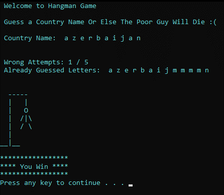

# Hangman
In the game of Hangman, the computer chooses a word at random from a given list of words. This word is the answer. The player then tries to guess the word, by guessing one letter at a time. Whenever the user guesses a letter that is in the answer, all occurrences of that letter are revealed to the user. The game ends when the user has guessed every letter in the word before he reaches the allowed number of strikes. This program is an interactive Hangman game. The focus is to use and manipulate strings and loops.

## Overview

In the game of Hangman, the computer chooses a word at random from a given list of words. This word is the
answer. The player then tries to guess the word, by guessing one letter at a time. Whenever the user guesses a
letter that is in the answer, all occurrences of that letter are revealed to the user. The game ends when the user
has guessed every letter in the word before he reaches the allowed number of strikes. This program is an
interactive Hangman game. The focus is to use and manipulate strings and loops.

## How to use

1. You can simply download the Hangman.exe from the repository and run it.
2. Or if you are afraid of .exe files than simply run the Hangman.cpp file in any compiler.

## Specifications and Features

1. This project implies the concepts of loops, functions, and other pre-defined functions like rand() and some
    string library functions, etc.
2. A function is used to display the Hangman visuals. It provides a user-friendly appeal to the game that is in
    console mode.
3. The computer generates a random country name from a dictionary provided in the code in the form of a
    string array.
4. The rand(); function is seeded to time(NULL); from <ctime> library.
5. Players must guess the whole word by entering letters one by one.
6. When the player enters a letter, the program automatically inputs the character and also displays it with
    the help of **_getche();** function
7. The program displays the secret word in the form of a password and as the user enters the correct letters,
    the secret word uncovers itself.
8. The player is given a set of lives/tries. In this game, there are 5 tries.
9. If a player fails a try, then one life will be taken.
10. If a player fails all the tries, then the character will be hanged and the program will display the “you failed
    message”.
11. In case the player successfully guesses the secret name, then the program displays a congratulations
    message.

# Console Output

